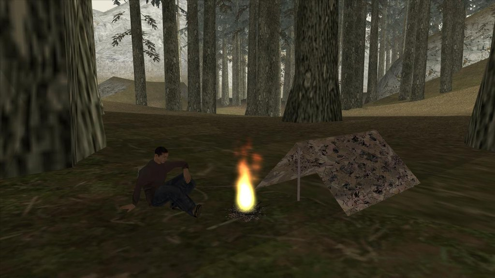

# Scavenge and Survive

Scavenge and Survive is a San Andreas Multiplayer server mod, a PvP survival
game where everyone is pitched against each other. Supplies are scarce and
everyone is willing to kill for the same goals! Safety in numbers is key to
survival, but trust is hard to find.

The game is run by the players. All rules and events are determined by players,
not staff or devs.

## The Wiki

This Wiki will document all the available items and most of their common uses or
craft combinations. Some things are left for the players to find but there's
nothing against anyone writing about their findings on this site!

- [Character](/wiki/character.md)
- [Items](/wiki/items.md)
- [Combining](/wiki/combining.md)
- [World](/wiki/world.md)
- [Weapons](/wiki/weapons.md)
- [Containers](/wiki/containers.md)
- [Vehicles](/wiki/vehicles.md)

## Contributors

[See a list of wiki contributors here!](contributors.md)
